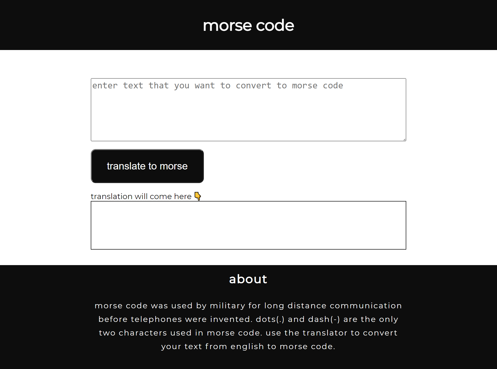

# Morse code translator app

This is a translator app which takes some text as input and translates it to morse code using fun translations api and displays the translated code.

## Overview

### Screenshot

### Links

- Live Site URL: [https://morse-code-translation-app.netlify.app/](https://morse-code-translation-app.netlify.app/)

## My process

### Built with

- HTML
- CSS
- JavaScript

### What I learned

- Writing basic fetch requests.
- Then converting the response to json using `response.json()`.
- Using `.innerHTML` or `.innerText` to change the contents of an html tag.

## Author

- Twitter - [@DarshanDamre](https://twitter.com/DarshanDamre)
- LinkedIn - [Darshan Damre](https://www.linkedin.com/in/darshandamre/)
- Website - [Darshan Damre](https://darshandamre.netlify.app/)
